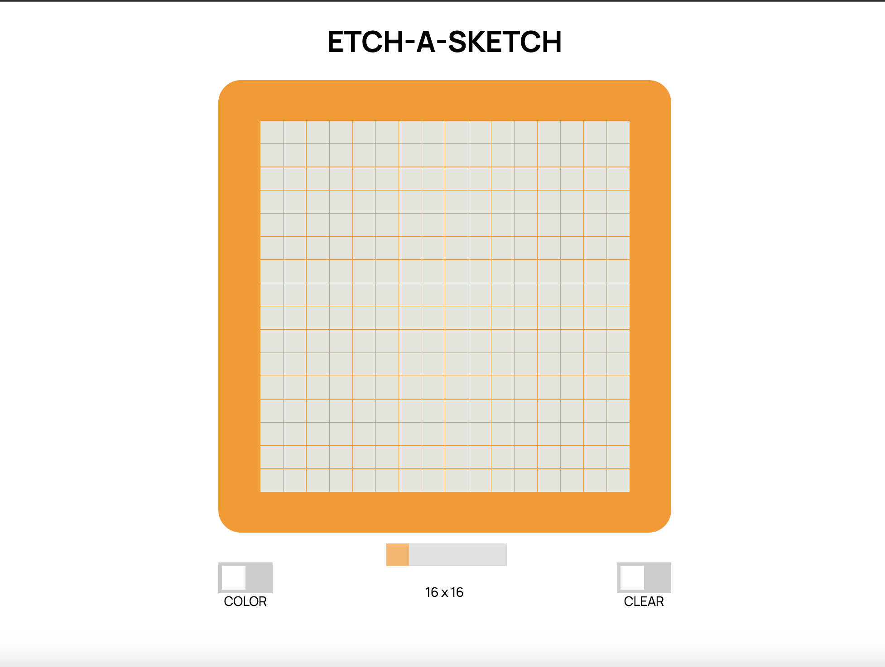

# etch-a-sketch
An Etch-A-Sketch game that lets you create your own pixel art. Just like the original classic drawing toy made in 1959.

Live - https://dylewskii.github.io/etch-a-sketch/ 

## Languages used:

-    
-    
- 

## Future TODO:
1. Fix grid slider (currently, the grid does not re-size inline with the slider options - 16x16, 32x32, 64x64)
